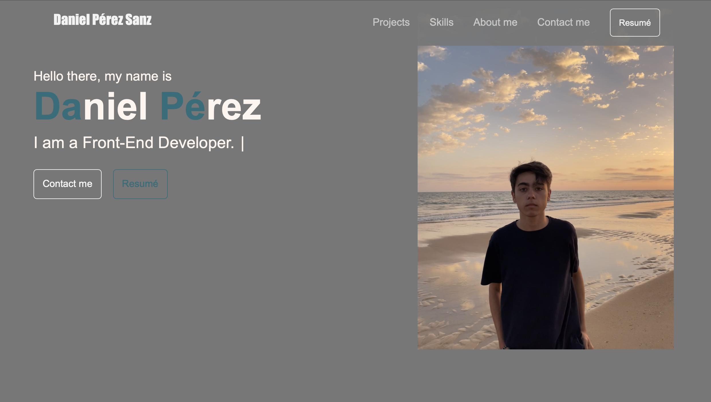

# PerezSanzDaniel_BootstrapPortfolio
Challenge Week 3: Bootstap portfolio

## Description 

This is my personal portfolio. It highlights my recent work as well as the thought processes behind it, as well as showing my skills. You can see a demo [here](https://danielpsnz.github.io/PerezSanzDaniel_BootstrapPortfolio/).

## Usage 

The portfolio should be seen as below: 

## Credits

[Daniel Pérez](https://github.com/danielpsnz)

## License

The license used is MIT License. Here is more information about it. 

[https://github.com/danielpsnz/PerezSanzDaniel_Portfolio/blob/main/LICENSE)
